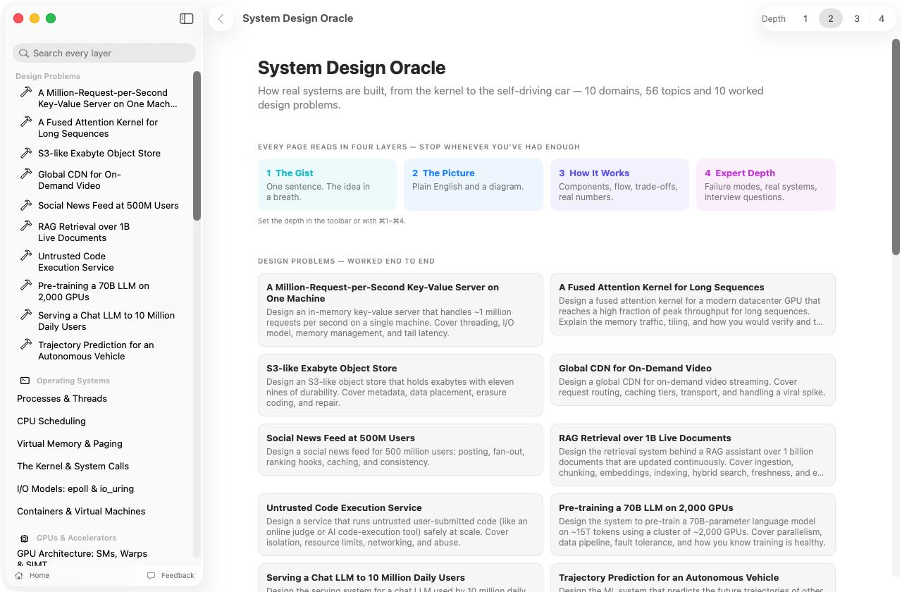
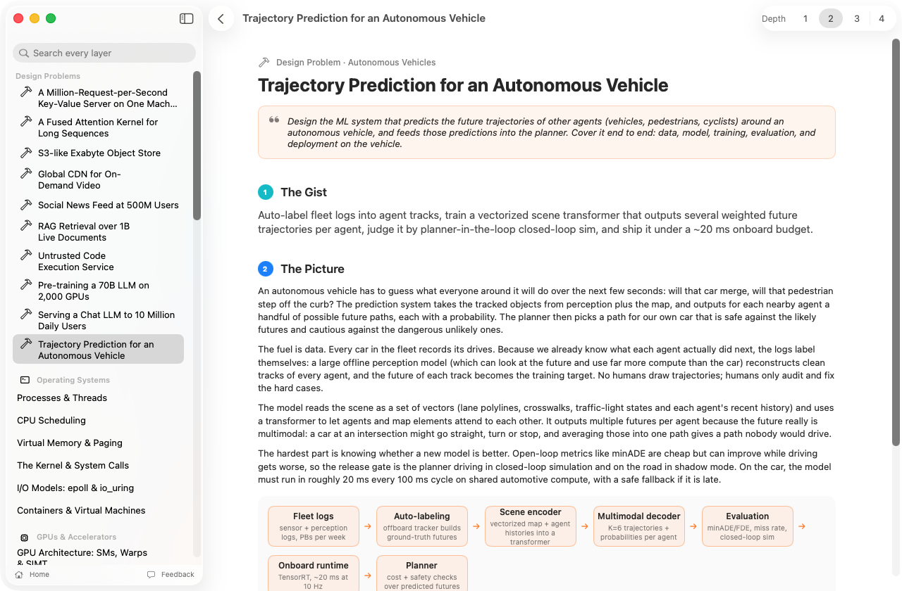
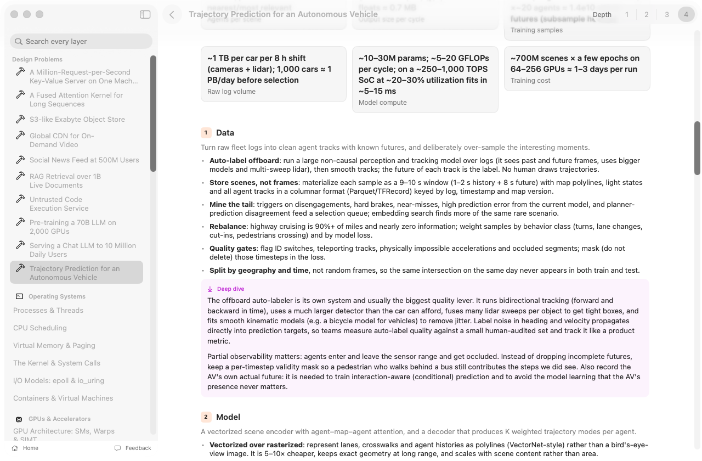
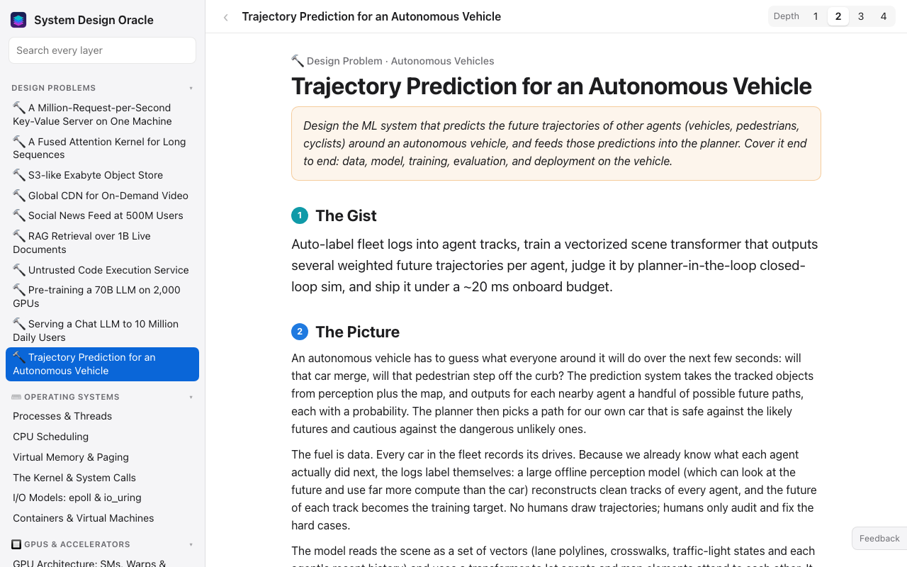
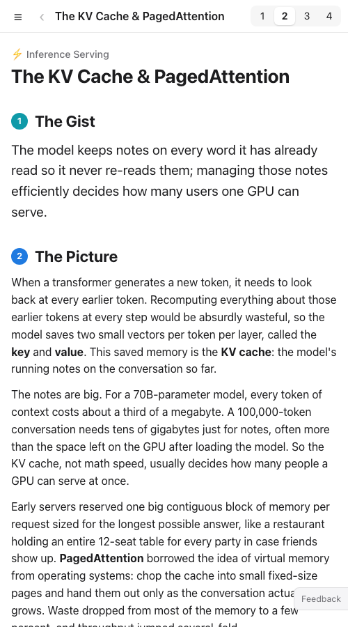

# System Design Oracle

A Mac app and website for learning system design across the stack. It covers 56 topics in 10 domains, from operating systems and GPUs up to LLM inference and autonomous vehicles, plus 10 worked end-to-end design problems. Every page reads in four layers, so you can stop at whatever depth you need.

| A design problem, layers 1–2 | The same problem, layers 3–4 |
|---|---|
|  |  |

| A concept topic | |
|---|---|
|  | **Domains:** Operating Systems · GPUs & Accelerators · Storage · Networking · Distributed Systems · Data Systems · Security · ML Training · Inference Serving · Autonomous Vehicles |

### On the web

The same content and the same four layers, in any browser, phones included.

| Desktop | Phone |
|---|---|
|  |  |

## Links

- [Website](https://amalmehta.github.io/SystemDesignOracle/)
- [Instructions](docs/INSTRUCTIONS.md): build, install, use, add content
- [File structure](docs/FILE-STRUCTURE.md): what's where
- [Content schema](docs/CONTENT-SCHEMA.md) · [Topic list](docs/TOPICS.md) · [Design problems](docs/PROBLEMS.md)
- [Send feedback](https://github.com/amalmehta/SystemDesignOracle/issues/new)
